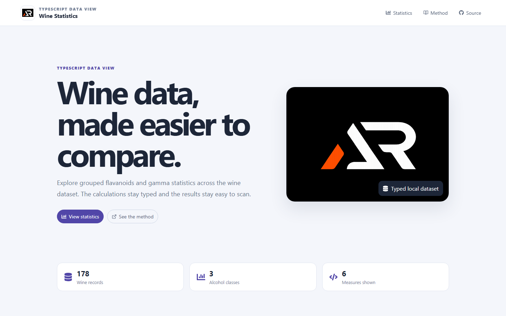

# TypeScript Wine Data Statistics

A TypeScript React dashboard that groups a wine dataset by alcohol class and compares flavanoids and derived gamma statistics.

## Features

- Typed grouped wine records by alcohol class
- Mean, median and mode calculations for two measures
- Responsive comparison tables with dataset summary cards
- Fixed responsive header, mobile navigation and go-to-top control
- Local branding, accessible links and simple border and shadow interactions

## Tech stack

React, TypeScript, Create React App, Sass modules and React Icons.

## Run locally

    npm install
    npm start

Create a production build with npm run build.

## Deployment

Live demo: [a2rp.github.io/manufac-typescript-react-winedata-stats](https://a2rp.github.io/manufac-typescript-react-winedata-stats/)

## Future improvements

The dashboard can be extended with filters, charts and downloadable summary data.

## Links

- Portfolio: [https://www.ashishranjan.net](https://www.ashishranjan.net)
- GitHub: [https://github.com/a2rp](https://github.com/a2rp)
- CodePen: [https://codepen.io/ash1198](https://codepen.io/ash1198)
- LinkedIn: [https://www.linkedin.com/in/aashishranjan](https://www.linkedin.com/in/aashishranjan)
- Facebook: [https://www.facebook.com/theash.ashish/](https://www.facebook.com/theash.ashish/)
- YouTube: [https://www.youtube.com/@ashishranjan-ashz?sub_confirmation=1](https://www.youtube.com/@ashishranjan-ashz?sub_confirmation=1)
- Email: [ash.ranjan09@gmail.com](mailto:ash.ranjan09@gmail.com)

## Support

- Support: [https://a2rp-donation-page.netlify.app/](https://a2rp-donation-page.netlify.app/)
- Buy Me a Coffee: [https://buymeacoffee.com/a2rp](https://buymeacoffee.com/a2rp)
- Patreon: [https://patreon.com/a2rp](https://patreon.com/a2rp)
